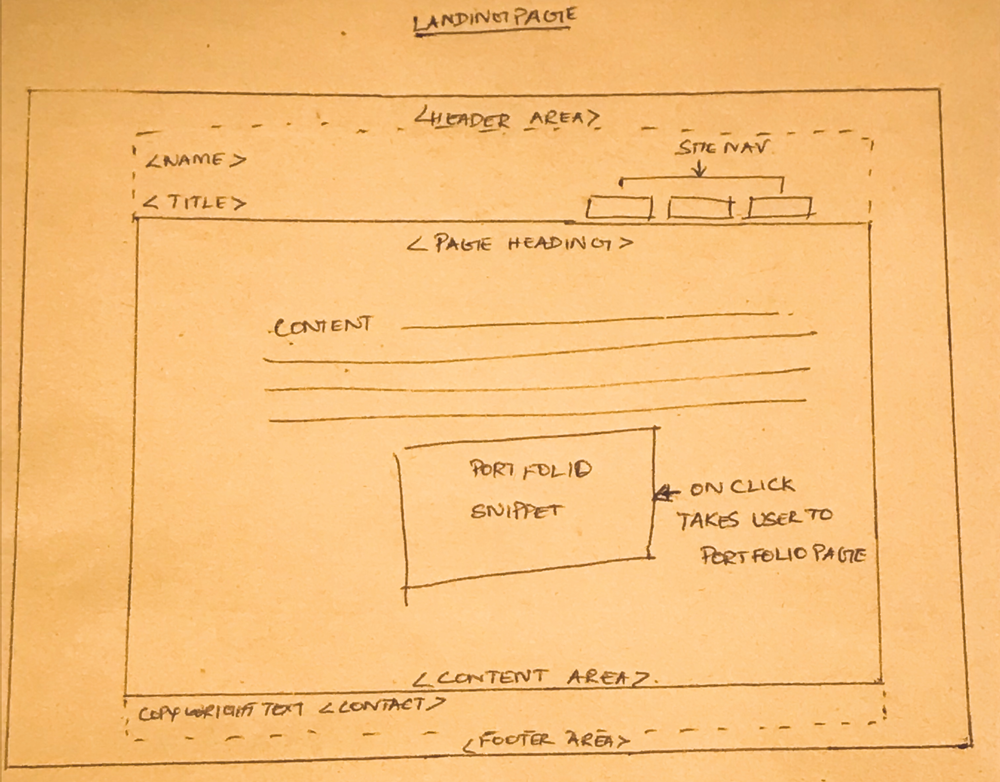
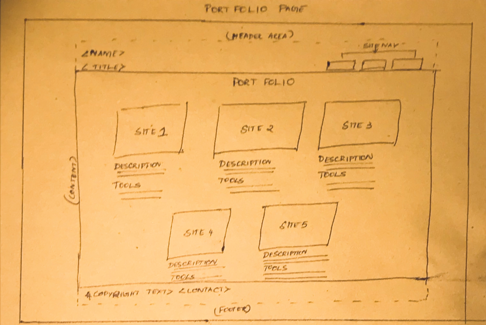

# My INF 7420 Project

I am going to rebuild an existing portfolio project. The main purpose of this project will be to showcase my work and help me find a job right before I graduate.

## Wireframes

I value planning so here are some wireframes to show how the site architechture and layout could turn out.

Header - will include my navigation menu and my name

Navigation Menu - will include links to other pages in the site.

Main Content - will talk about my skills and why I chose UX and highlight my skills

Footer - will include copyright and contact information